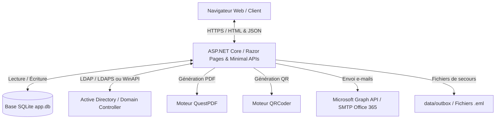

# Documentation Technique et Fonctionnelle - CoWork Manager

Cette documentation présente de manière exhaustive et structurée le projet **CoWork Manager** du groupe de **Sonny Ferreira** (Promotion B2 2026). Ce projet consiste en une plateforme intelligente de gestion d'un espace de coworking pour la société fictive **Laceris Tech**.

L'application intègre la gestion des utilisateurs (via base de données locale ou synchronisation **Active Directory**), la réservation d'espaces (bureaux nomades, bureaux privés, salles de réunion), le contrôle d'accès sécurisé par **QR code**, la facturation automatique au format PDF, et un système de notifications par e-mail.

---

## 1. Table des Matières

1. [Architecture Technique Générale](#2-architecture-technique-générale)
2. [Modèle de Données & Schéma SQLite](#3-modèle-de-données--schéma-sqlite)
3. [Architecture Logicielle & Services](#4-architecture-logicielle--services)
4. [Services & Intégrations Clés](#5-services--intégrations-clés)
5. [Interface Utilisateur & Pages Razor](#6-interface-utilisateur--pages-razor)
6. [Configuration du Système (appsettings.json)](#7-configuration-du-système-appsettingsjson)
7. [Installation et Démarrage](#8-installation-et-démarrage)
8. [Matrice des Droits & Rôles](#9-matrice-des-droits--rôles)
9. [Sécurité, Maintenance et Avertissements de Compilation](#10-sécurité-maintenance-et-avertissements-de-compilation)

---

## 2. Architecture Technique Générale

La plateforme est développée selon une architecture moderne et modulaire, s'appuyant sur l'écosystème .NET :

*   **Framework principal** : ASP.NET Core (Minimal APIs combiné à Razor Pages).
*   **Version du Framework** : [net10.0](file:///c:/0personnel/cours/informatique/projet-fin-dannee-b2/Projet_B2/Projet_B2.csproj#L5).
*   **Base de données** : SQLite, une base relationnelle légère et intégrée, gérée via [DbHelpers.cs](file:///c:/0personnel/cours/informatique/projet-fin-dannee-b2/Projet_B2/DbHelpers.cs).
*   **Authentification & Sécurité** :
    *   Authentification par cookie (`CookieAuthenticationDefaults`).
    *   Mots de passe hachés localement avec l'algorithme **PBKDF2-SHA256** (100 000 itérations).
    *   Intégration d'un annuaire d'entreprise **Active Directory** (via protocole LDAPS ou l'API AccountManagement).
*   **Bibliothèques tierces clés** :
    *   `QuestPDF` : Conception et génération fluide de documents de facturation au format PDF.
    *   `QRCoder` : Génération à la volée de codes QR en flux d'octets PNG pour le contrôle d'accès.
    *   `MailKit` & `MimeKit` : Manipulation et envoi de courriels (SMTP).
    *   `Microsoft.Identity.Client` : Bibliothèque MSAL utilisée pour l'envoi de courriels via l'API Microsoft Graph (Office 365).



---

## 3. Modèle de Données & Schéma SQLite

La base de données SQLite est initialisée et migrée automatiquement au démarrage de l'application via le code de la classe [DbHelpers](file:///c:/0personnel/cours/informatique/projet-fin-dannee-b2/Projet_B2/DbHelpers.cs).

### 3.1. Structure des Tables

#### Table `Users` (Utilisateurs)
Stocke les comptes locaux et les liens d'affiliation avec l'Active Directory.
*   `Id` (INTEGER PRIMARY KEY AUTOINCREMENT) : Identifiant unique de l'utilisateur.
*   `Name` (TEXT) : Prénom ou identifiant de connexion.
*   `Last_Name` (TEXT) : Nom de famille.
*   `Email` (TEXT UNIQUE) : Adresse e-mail servant d'identifiant principal.
*   `Role` (TEXT) : Rôle de l'utilisateur (`Admin`, `Member`, `User`, `Accueil`, `Comptabilite`).
*   `PasswordHash` (TEXT) : Hachage de mot de passe PBKDF2 (Base64). Vaut `NULL` si l'authentification AD est activée.
*   `AccountEnabled` (INTEGER NOT NULL DEFAULT 1) : Indicateur d'état du compte (1 = actif, 0 = désactivé).
*   `EmailVerified` (INTEGER NOT NULL DEFAULT 0) : Statut de validation de l'adresse e-mail.
*   `EmailVerifyToken` (TEXT) : Jeton de sécurité pour l'URL de vérification.
*   `ADSamAccountName` (TEXT) : Identifiant de connexion sAMAccountName sur l'Active Directory.
*   `ADUserPrincipalName` (TEXT) : Identifiant principal de l'utilisateur (UPN) sur l'Active Directory.
*   `ADObjectGuid` (TEXT) : Identifiant unique d'objet (GUID) dans l'Active Directory.

#### Table `Spaces` (Espaces de travail)
Définit les espaces réservables dans le bâtiment.
*   `ID` (INTEGER PRIMARY KEY AUTOINCREMENT) : Identifiant unique.
*   `Name` (TEXT NOT NULL) : Nom de l'espace (ex: "Nomad Desk A", "Meeting Room D").
*   `Capacity` (INTEGER) : Capacité maximale d'accueil en nombre de personnes.
*   `PricePerHour` (REAL NOT NULL DEFAULT 5.0) : Tarif horaire hors taxes de l'espace.
*   `Type` (TEXT NOT NULL DEFAULT 'Nomad') : Catégorie d'espace (`Nomad`, `Office`, `Meeting`, `Conference`).

#### Table `Reservation` (Réservations)
Associe un utilisateur à un espace sur un créneau horaire donné.
*   `ID` (INTEGER PRIMARY KEY AUTOINCREMENT) : Identifiant de la réservation.
*   `OwnerId` (INTEGER NOT NULL) : Clé étrangère pointant vers `Users(Id)`.
*   `SpaceId` (INTEGER) : Clé étrangère pointant vers `Spaces(ID)`.
*   `Starting_Date` (TEXT) : Date et heure de début au format ISO 8601 UTC.
*   `Ending_Date` (TEXT) : Date et heure de fin au format ISO 8601 UTC.
*   `Date` (TEXT) : Date de la réservation sous la forme `YYYY-MM-DD`.
*   `StartHour` (INTEGER) : Heure de début (0 à 23).
*   `Hours` (INTEGER) : Durée de la réservation en heures (1 à 12).
*   `Status` (TEXT) : Statut de la réservation (`Booked`, `Cancelled`).
*   `Total_Amount` (REAL) : Montant total Hors Taxes (HT) de la réservation.
*   `Attendees` (TEXT) : Liste d'adresses e-mail des invités séparées par des virgules.
*   `AccessToken` (TEXT) : Jeton aléatoire unique servant à l'encodage du QR Code d'accès physique.

#### Table `Facture` (Facturation)
Représente les factures émises lors de la validation des réservations.
*   `ID` (INTEGER PRIMARY KEY AUTOINCREMENT) : Identifiant unique.
*   `Num_facture` (TEXT) : Numéro de facture normalisé (ex: `INV-20260625-00042`).
*   `date_facture` (TEXT) : Date de génération de la facture au format ISO 8601.
*   `Amount_HT` (REAL) : Montant total Hors Taxes.
*   `Amount_TVA` (REAL) : Montant de la TVA calculé selon le taux configuré.
*   `Amount_TTC` (REAL) : Montant TTC facturé.
*   `Payment_Status` (TEXT) : Statut du paiement (`Pending`, `Paid`, `Cancelled`).
*   `ReservationId` (INTEGER UNIQUE) : Clé étrangère pointant vers `Reservation(ID)`.
*   `PdfPath` (TEXT) : Chemin d'accès sur le disque vers le document PDF généré.

#### Table `Ressources` (Ressources / Équipements)
Gère l'équipement optionnel lié à un espace ou une réservation.
*   `ID` (INTEGER PRIMARY KEY AUTOINCREMENT) : Identifiant unique.
*   `Name_ressource` (TEXT) : Nom de la ressource (ex: "Projecteur", "Écran 4K").
*   `Type_ressources` (TEXT) : Type ou catégorie d'équipement.
*   `Capacity` (INTEGER) : Quantité de ressources disponibles.
*   `Price` (REAL) : Prix de location de la ressource.
*   `ReservationId` (INTEGER) : Clé étrangère pointant vers `Reservation(ID)`.
*   `SpaceId` (INTEGER) : Clé étrangère pointant vers `Spaces(ID)`.

#### Table `AuditLog` (Journalisation de sécurité)
Enregistre les actions administratives et de sécurité importantes.
*   `Id` (INTEGER PRIMARY KEY AUTOINCREMENT) : Identifiant unique du log.
*   `Timestamp` (TEXT NOT NULL) : Date/heure de l'action en UTC.
*   `UserName` (TEXT) : Utilisateur à l'origine de l'action (ou `"system"`).
*   `Action` (TEXT NOT NULL) : Type d'action (`BookingCreate`, `UserDisable`, `AccessGranted`, etc.).
*   `Target` (TEXT) : Ressource ciblée par l'action (ex: `Reservation#42`).
*   `Details` (TEXT) : Détails textuels additionnels.

#### Table `Reminders` (Suivi des rappels)
Assure qu'un e-mail de rappel n'est envoyé qu'une seule fois.
*   `ID` (INTEGER PRIMARY KEY AUTOINCREMENT) : Identifiant unique.
*   `ReservationId` (INTEGER NOT NULL UNIQUE) : Clé étrangère pointant vers `Reservation(ID)`.
*   `SentAt` (TEXT NOT NULL) : Horodatage d'envoi.

---

## 4. Architecture Logicielle & Services

Le code applicatif s'articule autour de plusieurs classes de services autonomes, instanciées via l'injecteur de dépendances natif de .NET dans [Program.cs](file:///c:/0personnel/cours/informatique/projet-fin-dannee-b2/Projet_B2/Program.cs).

### 4.1. ActiveDirectoryService
La classe [ActiveDirectoryService.cs](file:///c:/0personnel/cours/informatique/projet-fin-dannee-b2/Projet_B2/ActiveDirectoryService.cs) orchestre la communication avec le contrôleur de domaine Windows.

*   **Mode Hybride** : Le service détecte l'environnement d'exécution de l'API. Si elle tourne sur Windows, elle privilégie l'API managée `System.DirectoryServices.AccountManagement`. Si elle tourne sur Linux ou macOS, elle bascule automatiquement sur des requêtes réseau bas niveau via le protocole **LDAP / LDAPS** (`System.DirectoryServices.Protocols`).
*   **Provisioning Automatique** : Lors de l'inscription ou de la première connexion d'un utilisateur possédant un mot de passe correct, un compte AD est provisionné automatiquement via [ProvisionAdAccountOrThrow](file:///c:/0personnel/cours/informatique/projet-fin-dannee-b2/Projet_B2/Program.cs#L115) dans l'OU configurée.
*   **Synchronisation des Statuts** : L'activation ou la désactivation d'un compte utilisateur en base locale répercute l'état du compte dans l'Active Directory, en déplaçant le compte AD entre l'OU active et l'OU de mise au rebut (ex: `OU=Desactives`).
*   **Validation des Informations** : Il applique les stratégies de complexité des mots de passe AD et empêche les doublons d'UPN (User Principal Name) et de sAMAccountName.

### 4.2. InvoiceService
Le service [InvoiceService.cs](file:///c:/0personnel/cours/informatique/projet-fin-dannee-b2/Projet_B2/InvoiceService.cs) prend en charge le traitement financier :
*   **Extraction des lignes de facturation** : Il regroupe les réservations d'une même session de paiement pour générer une facture unique contenant plusieurs lignes.
*   **Calcul de la TVA** : Il calcule automatiquement le montant HT, le montant de la TVA (généralement 20%) et le TTC.
*   **Génération du document de facturation** : Il utilise **QuestPDF** pour mettre en page un document PDF professionnel. Ce PDF contient l'entête de Laceris Tech, les coordonnées du client, le tableau récapitulatif détaillé et, le cas échéant, le rendu visuel sous forme d'image PNG des **pass d'entrée QR Code** générés pour chaque créneau.
*   **Persistance physique** : Les factures sont stockées dans le répertoire `data/invoices`.

### 4.3. QrService
La classe [QrService.cs](file:///c:/0personnel/cours/informatique/projet-fin-dannee-b2/Projet_B2/QrService.cs) est une classe utilitaire simplifiée s'appuyant sur la bibliothèque `QRCoder` :
*   `GeneratePng(string content, int pixelsPerModule)` : Prend une chaîne de caractères (le token d'accès de la réservation) et produit le flux d'octets binaire correspondant au fichier image PNG du QR code.
*   `NewToken()` : Génère des jetons aléatoires hautement sécurisés de format hexadécimal chaîné (ex: `a1b2c3d4...-e5f6...`).

### 4.4. EmailService
Le service [EmailService.cs](file:///c:/0personnel/cours/informatique/projet-fin-dannee-b2/Projet_B2/EmailService.cs) gère toute la communication transactionnelle sortante.
Il propose deux canaux d'envoi configurables :
1.  **API Microsoft Graph (Office 365 / Entra ID)** : Envoi moderne via jeton OAuth2 applicatif (flow *Client Credentials* via `ConfidentialClientApplicationBuilder`).
2.  **Canal de secours (Outbox Mock)** : Si aucun serveur de messagerie n'est configuré (ex: en phase de développement), le service enregistre automatiquement les e-mails générés sous forme de fichiers de messagerie `.eml` bruts dans le répertoire physique `data/outbox` de l'application.

Il implémente les méthodes d'envoi spécialisées suivantes :
*   `SendWelcomeAsync` : Courriel de bienvenue avec lien d'activation de compte.
*   `SendBookingConfirmationAsync` : Confirmation d'achat avec tableau des réservations et **facture PDF en pièce jointe**.
*   `SendBookingCancellationAsync` / `SendBookingModifiedAsync` : Notifications en cas d'annulation ou d'ajustement de planning.
*   `SendReminderAsync` : Rappel de réservation à envoyer une heure avant le début.
*   `SendInviteAsync` : Envoi d'invitations aux personnes tierces conviées à une réunion dans l'espace réservé.

### 4.5. ReminderService
La classe [ReminderService.cs](file:///c:/0personnel/cours/informatique/projet-fin-dannee-b2/Projet_B2/ReminderService.cs) est un service d'arrière-plan (`BackgroundService`) démarré en tâche de fond par ASP.NET Core :
*   Il s'exécute continuellement et effectue un cycle de vérification (tick) toutes les 60 secondes.
*   Il recherche en base de données les réservations dont le statut est validé (`Booked`) et dont l'heure de démarrage se situe dans une fenêtre comprise entre **55 et 65 minutes** par rapport à l'heure UTC actuelle (Rappel H-1).
*   Pour chaque réservation éligible non encore traitée, il appelle le service e-mail pour notifier l'adhérent, écrit une ligne de confirmation dans la table `Reminders` pour éviter tout doublon d'envoi, et logue l'événement dans le journal d'audit.

---

## 5. Services & Intégrations Clés

### 5.1. Gestion du Panier Multi-Réservations
L'application propose de réserver plusieurs espaces ou plusieurs créneaux simultanément.
*   Le client ajoute ses créneaux dans un panier géré côté client (dans le cache du navigateur local).
*   Lors du clic sur le bouton de paiement, la requête transmet la liste des réservations demandées à l'endpoint API `/api/cart/checkout`.
*   Le backend vérifie séquentiellement les conflits de créneaux sur chacun des éléments du panier pour éviter le surbooking.
*   Si aucun conflit n'est détecté, les lignes de réservation sont enregistrées en bloc en base de données.
*   Une facture globale regroupant l'ensemble de ces réservations est générée et envoyée par e-mail en une seule fois.

### 5.2. Système de Validation et de Contrôle d'Accès QR Code
*   Chaque réservation possède un jeton d'accès unique (`AccessToken`) associé.
*   Le client peut afficher son QR code sur son espace personnel en ligne (via l'appel de l'API `/api/reservations/{id}/qr`), ou le retrouver directement imprimé en bas de sa facture PDF reçue par e-mail.
*   Un portail physique ou une tablette tenue par le personnel d'accueil utilise l'endpoint `/api/access/verify` en soumettant le token scanné.
*   Le système autorise l'accès (retourne `granted = true`) uniquement si la réservation associée possède le statut `"Booked"` et si le scan a lieu dans une fenêtre horaire valide (au plus tôt **15 minutes avant le début** de la réservation et au plus tard à l'heure de fin).
*   Chaque tentative d'accès est consignée dans l'audit (`AccessGranted` ou `AccessDenied`).

---

## 6. Interface Utilisateur & Pages Razor

L'interface de l'application utilise **Bootstrap 5.3** pour un rendu adaptatif (responsive) de qualité professionnelle et une feuille de style personnalisée [styles.css](file:///c:/0personnel/cours/informatique/projet-fin-dannee-b2/Projet_B2/wwwroot/css/styles.css).

```
Pages/
├── _Layout.cshtml             # Squelette HTML, barre de navigation dynamique & scripts communs
├── _ViewImports.cshtml        # Importation des namespaces et directives Razor communes
├── Index.cshtml               # Page d'accueil avec indicateurs statistiques globaux
├── Login.cshtml               # Formulaire de connexion
├── Signup.cshtml              # Formulaire d'inscription des nouveaux utilisateurs
├── Spaces.cshtml              # Catalogue visuel des différents espaces de coworking
├── SpacesMap.cshtml           # Plan interactif de l'établissement en format SVG
├── Booking.cshtml             # Interface de réservation intégrant le calendrier FullCalendar
├── MyReservations.cshtml      # Liste des réservations personnelles, téléchargement des factures & codes QR
├── AdminDashboard.cshtml      # Vue statistiques globale du chiffre d'affaires et taux d'occupation (Admin/Compta)
├── AdminUsers.cshtml          # Panneau d'administration des comptes utilisateurs (Admin)
├── AdminReservations.cshtml   # Gestion unifiée des réservations en base (Admin/Compta)
├── AdminAudit.cshtml          # Lecture et filtrage du journal de sécurité (Admin)
└── AdminAccess.cshtml         # Module d'accueil pour flasher/vérifier manuellement les codes QR (Admin/Accueil)
```

Côté client, le script [app.js](file:///c:/0personnel/cours/informatique/projet-fin-dannee-b2/Projet_B2/wwwroot/js/app.js) assure le contrôle de l'état de session utilisateur, gère l'affichage dynamique des menus d'administration selon le rôle décodé par l'appel API `/api/me`, et gère l'affichage des notifications Toast de l'interface.

---

## 7. Configuration du Système (appsettings.json)

Le fichier [appsettings.json](file:///c:/0personnel/cours/informatique/projet-fin-dannee-b2/Projet_B2/appsettings.json) centralise le paramétrage technique de l'application.

```json
{
  "Logging": {
    "LogLevel": {
      "Default": "Information",
      "Microsoft.AspNetCore": "Warning"
    }
  },
  "AllowedHosts": "*",
  "Company": {
    "Name": "CoWork Manager",
    "Address": "1 Avenue du Coworking, 75000 Paris",
    "Siret": "000 000 000 00000",
    "TvaRate": 0.20
  },
  "ActiveDirectory": {
    "Enabled": true,
    "Mode": "Auto",
    "DomainDnsName": "LacerisTech.local",
    "NetBiosName": "LACERISTECH",
    "DomainController": "AD1-LACERIS.LacerisTech.local",
    "DomainControllerIp": "192.168.10.10",
    "BaseDistinguishedName": "DC=LacerisTech,DC=local",
    "UsersContainerDistinguishedName": "OU=Visiteurs,OU=Comptes,OU=_LACERISTECH,DC=LacerisTech,DC=local",
    "DisabledUsersContainerDistinguishedName": "OU=Desactives,OU=_LACERISTECH,DC=LacerisTech,DC=local",
    "UseLdaps": true,
    "LdapPort": 636,
    "LdapTimeoutSeconds": 10,
    "IgnoreCertificateErrors": false,
    "ServiceAccountUserEnvironmentVariable": "AD_SERVICE_USERNAME",
    "ServiceAccountPasswordEnvironmentVariable": "AD_SERVICE_PASSWORD"
  },
  "Smtp": {
    "Host": "smtp.office365.com",
    "Port": 587,
    "User": "Info-coworking@LacerisTech.onmicrosoft.com",
    "From": "Info-coworking@LacerisTech.onmicrosoft.com",
    "FromName": "CoWork Manager",
    "UseStartTls": true,
    "ClientId": "7d4327e5-8329-45e2-9940-f42ce9fbea56",
    "TenantId": "ed20e9b6-e529-4a36-aabc-d9cf4348a675",
    "ClientSecret": "REPLACE_WITH_ENV_SECRET"
  }
}
```

### 7.1. Variables d'Environnement de Production
Pour des raisons évidentes de sécurité, les secrets ne doivent pas figurer en clair dans le fichier de configuration.
L'application recherche les variables d'environnement suivantes au démarrage :
*   `AD_SERVICE_USERNAME` : Le nom du compte de service Active Directory utilisé pour administrer les comptes.
*   `AD_SERVICE_PASSWORD` : Le mot de passe de ce compte de service.
*   Le secret client Microsoft Graph ou le mot de passe SMTP peut être renseigné en lieu et place de `"REPLACE_WITH_ENV_SECRET"` ou injecté via les mécanismes standards de secrets d'ASP.NET.

---

## 8. Installation et Démarrage

### 8.1. Prérequis
1.  Disposer du **SDK .NET 10.0** ou supérieur.
2.  Optionnel : Un contrôleur de domaine Active Directory opérationnel si `ActiveDirectory:Enabled` est positionné sur `true`.

### 8.2. Restauration et Compilation
Ouvrez un terminal dans le répertoire contenant le fichier [Projet_B2.sln](file:///c:/0personnel/cours/informatique/projet-fin-dannee-b2/Projet_B2/Projet_B2.sln) :

```bash
# Restaurer les dépendances NuGet
dotnet restore

# Compiler le projet
dotnet build --configuration Release
```

### 8.3. Lancement de l'Application
```bash
# Se placer dans le répertoire du projet exécutable
cd Projet_B2

# Démarrer le serveur web
dotnet run
```

Par défaut, l'application démarre un serveur Kestrel sécurisé écoutant à l'adresse suivante :
*   `https://localhost:5001`

### 8.4. Initialisation des Données
Lors du tout premier lancement, l'application initialise automatiquement un fichier de base de données SQLite localisé dans le répertoire parent `data/app.db`.
Les traitements suivants sont exécutés automatiquement au premier démarrage :
1.  Création des tables et exécution des migrations.
2.  Provisioning d'un compte administrateur par défaut :
    *   **Email** : `admin@example.com`
    *   **Mot de passe** : `admin123`
3.  Génération d'un jeu de données d'espaces par défaut (Bureaux nomades, Salles de conférence, Bureaux privés).

---

## 9. Matrice des Droits & Rôles

Le système met en application un contrôle d'accès basé sur les rôles de l'utilisateur (RBAC).

| Fonctionnalité / Endpoint | Utilisateur non connecté | Rôle `User` / `Member` | Rôle `Accueil` | Rôle `Comptabilite` | Rôle `Admin` |
| :--- | :---: | :---: | :---: | :---: | :---: |
| Connexion / Inscription | **Oui** | Oui | Oui | Oui | Oui |
| Consulter les espaces | Non | **Oui** | Oui | Oui | Oui |
| Consulter le Plan interactif | Non | **Oui** | Oui | Oui | Oui |
| Réserver un espace (création) | Non | **Oui** | Oui | Oui | Oui |
| Consulter / Annuler ses propres réservations | Non | **Oui** | Oui | Oui | Oui |
| Accéder au Tableau de Bord de gestion | Non | Non | Non | **Oui** | **Oui** |
| Visualiser toutes les réservations du site | Non | Non | Non | **Oui** | **Oui** |
| Gérer les utilisateurs (activer/désactiver/rôle) | Non | Non | Non | Non | **Oui** |
| Réinitialiser le mot de passe AD / local d'un utilisateur | Non | Non | Non | Non | **Oui** |
| Valider un QR code d'accès à l'entrée | Non | Non | **Oui** | Non | **Oui** |
| Exécuter et télécharger un Backup SQLite | Non | Non | Non | Non | **Oui** |
| Consulter les journaux d'audit de sécurité | Non | Non | Non | Non | **Oui** |

---

## 10. Sécurité, Maintenance et Avertissements de Compilation

Lors de la compilation de l'application (notamment avec le SDK .NET 10.0), certains avertissements peuvent apparaître. Voici comment les interpréter et les résoudre :

### 10.1. Avertissement SYSLIB0060 (Obsolescence de Rfc2898DeriveBytes)
*   **Message** : `warning SYSLIB0060: 'Rfc2898DeriveBytes.Rfc2898DeriveBytes(...)' est obsolète. Use the static Pbkdf2 method instead.`
*   **Cause** : Les constructeurs d'instance de la classe `Rfc2898DeriveBytes` sont obsolètes à partir de .NET 8 pour encourager l'utilisation de la méthode statique plus performante et plus sûre.
*   **Résolution** :
    Dans [DbHelpers.cs](file:///c:/0personnel/cours/informatique/projet-fin-dannee-b2/Projet_B2/DbHelpers.cs#L170-L172), modifier :
    ```csharp
    var pbkdf2 = new Rfc2898DeriveBytes(password, salt, 100_000, HashAlgorithmName.SHA256);
    var test = pbkdf2.GetBytes(32);
    ```
    par :
    ```csharp
    var test = Rfc2898DeriveBytes.Pbkdf2(password, salt, 100_000, HashAlgorithmName.SHA256, 32);
    ```
    Faire la même modification dans [DbHelpers.cs](file:///c:/0personnel/cours/informatique/projet-fin-dannee-b2/Projet_B2/DbHelpers.cs#L207-L209) pour le hachage de mot de passe à la création d'utilisateur.

### 10.2. Avertissement NU1903 (Vulnérabilité SQLitePCLRaw)
*   **Message** : `warning NU1903: Package 'SQLitePCLRaw.lib.e_sqlite3' 2.1.2 has a known high severity vulnerability`
*   **Cause** : Le package `Microsoft.Data.Sqlite` version `6.0.15` utilise une dépendance transitive vulnérable.
*   **Résolution** : Mettre à jour la dépendance dans [Projet_B2.csproj](file:///c:/0personnel/cours/informatique/projet-fin-dannee-b2/Projet_B2/Projet_B2.csproj#L11) vers une version plus récente et supportée par .NET 10.0 (ex: `8.0.x` ou `9.0.x`).

### 10.3. Avertissement NETSDK1206 (Runtime Identifiers spécifiques à la version)
*   **Message** : `warning NETSDK1206: Identifiant(s) d'exécution spécifique(s) à la version ou à la distribution trouvé(s) ...`
*   **Cause** : Changement de comportement dans le ciblage des Runtime Identifiers (RIDs) sous .NET 8.0/10.0 pour certaines plateformes comme Alpine.
*   **Résolution** : Peut être ignoré en développement ou résolu en mettant à jour les paquets dépendants vers leurs versions récentes ciblant nativement .NET 8.0+.
